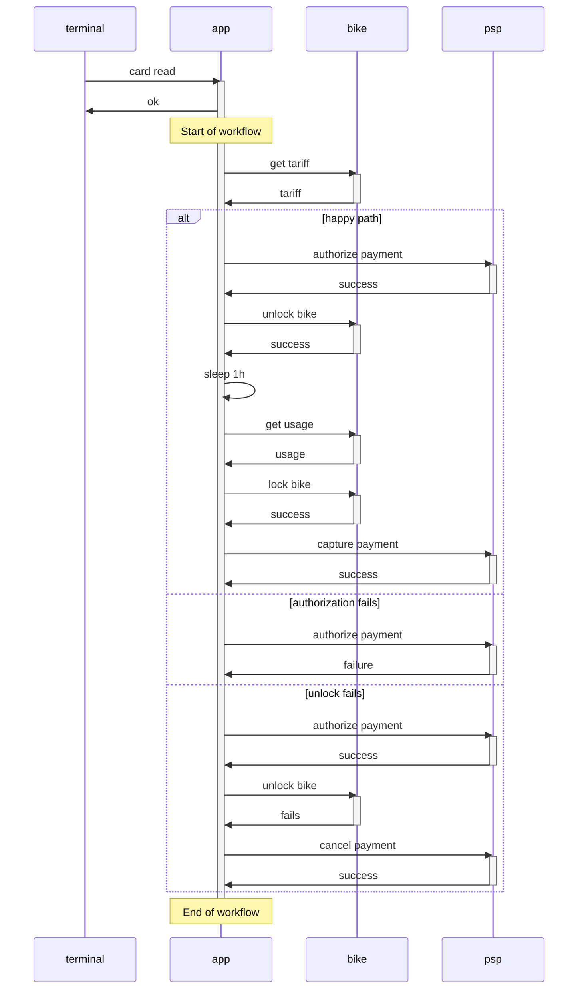

```mermaid
sequenceDiagram
  terminal ->> app: card read
  activate app
  app ->> terminal: ok

  note over app: Start of workflow

  app ->> bike: get tariff
  activate bike
  bike ->> app: tariff
  deactivate bike

  alt happy path

    app ->> psp: authorize payment
    activate psp
    psp ->> app: success
    deactivate psp

    app ->> bike: unlock bike
    activate bike
    bike ->> app: success
    deactivate bike

    app ->> app: sleep 1h

    app ->> bike: get usage
    activate bike
    bike ->> app: usage
    deactivate bike

    app ->> bike: lock bike
    activate bike
    bike ->> app: success
    deactivate bike

    app ->> psp: capture payment
    activate psp
    psp ->> app: success
    deactivate psp

  else authorization fails

    app ->> psp: authorize payment
    activate psp
    psp ->> app: failure
    deactivate psp

  else unlock fails

    app ->> psp: authorize payment
    activate psp
    psp ->> app: success
    deactivate psp

    app ->> bike: unlock bike
    activate bike
    bike ->> app: fails
    deactivate bike

    app ->> psp: cancel payment
    activate psp
    psp ->> app: success
    deactivate psp

  end

  note over app: End of workflow

  deactivate app
```