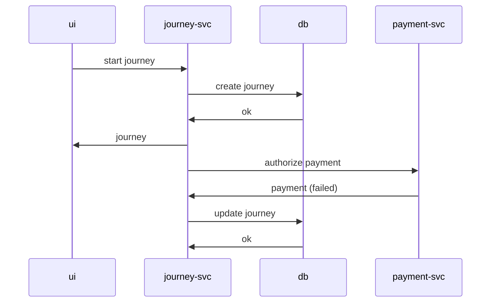
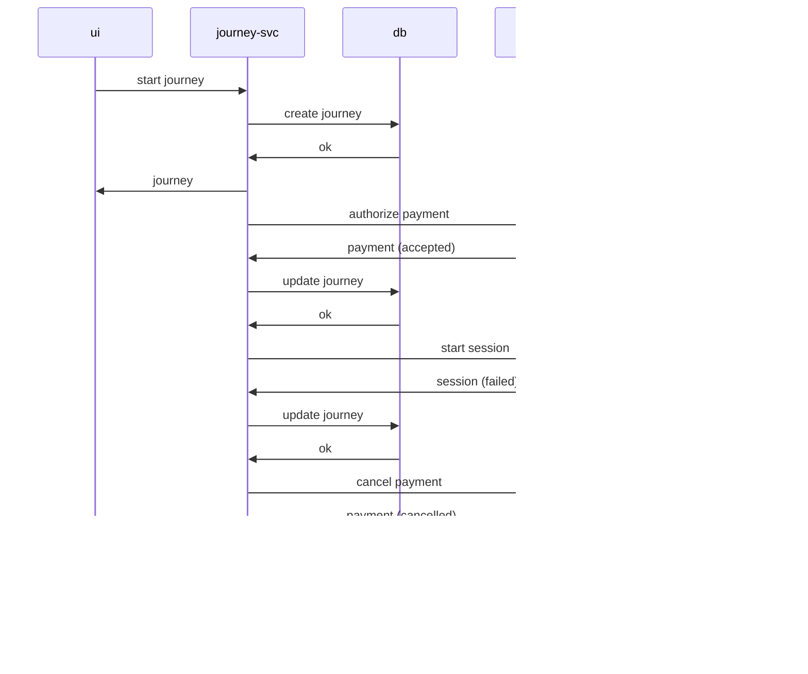
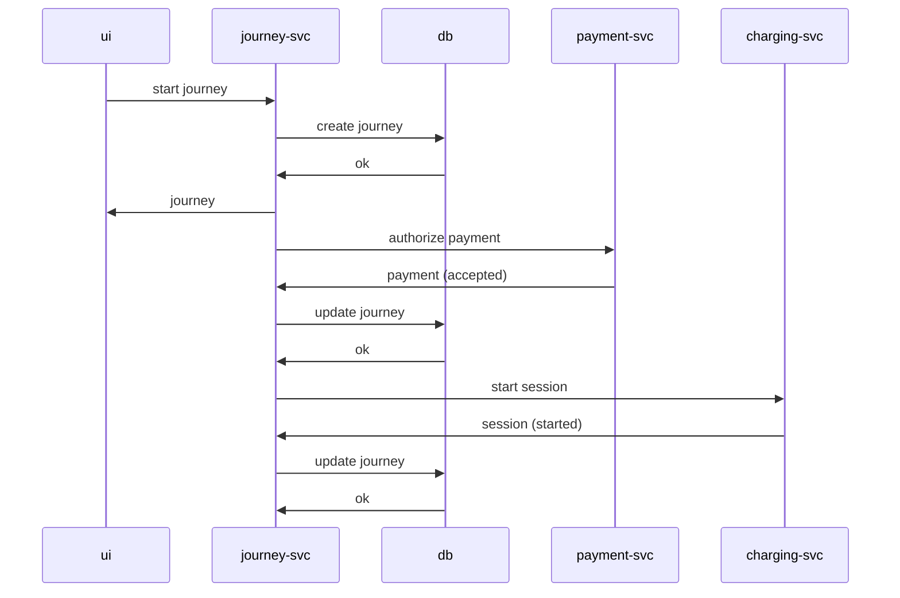
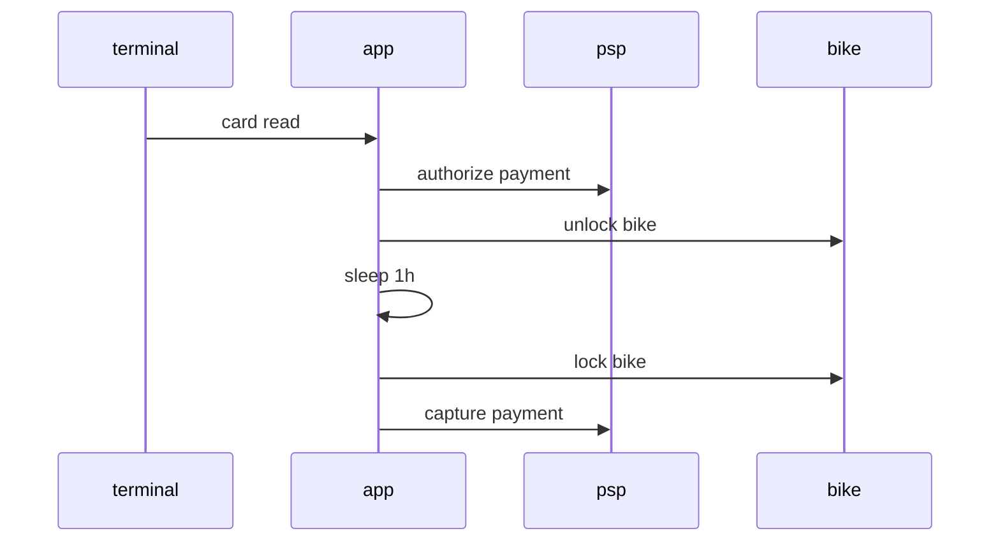
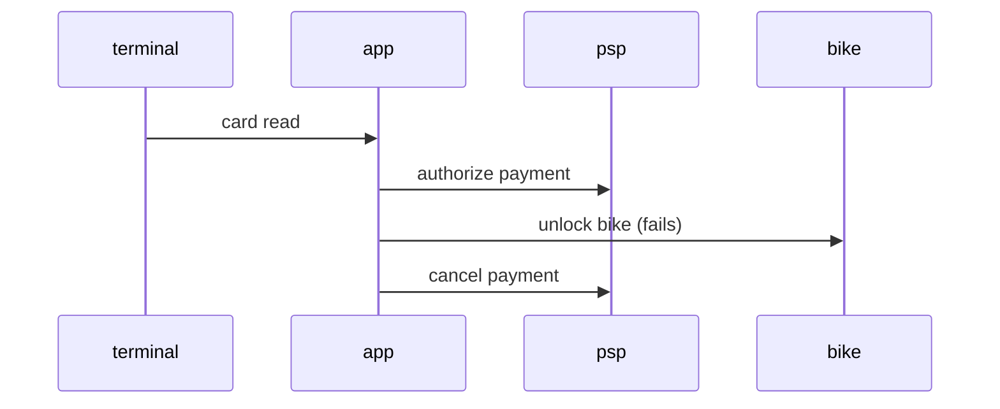
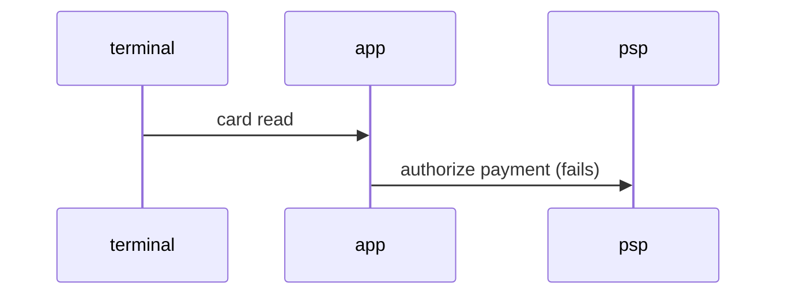

```mermaid
sequenceDiagram
  ui ->> journey-svc: start journey
  journey-svc ->> db: create journey
  db ->> journey-svc: ok
  journey-svc ->> ui: journey

  journey-svc ->> payment-svc: authorize payment
  payment-svc ->> journey-svc: payment (failed)

  journey-svc ->> db: update journey
  db ->> journey-svc: ok
```

```mermaid
sequenceDiagram
  ui ->> journey-svc: start journey
  journey-svc ->> db: create journey
  db ->> journey-svc: ok
  journey-svc ->> ui: journey

  journey-svc ->> payment-svc: authorize payment
  payment-svc ->> journey-svc: payment (accepted)

  journey-svc ->> db: update journey
  db ->> journey-svc: ok

  journey-svc ->> charging-svc: start session
  charging-svc ->> journey-svc: session (failed)

  journey-svc ->> db: update journey
  db ->> journey-svc: ok

  journey-svc ->> payment-svc: cancel payment
  payment-svc ->> journey-svc: payment (cancelled)

  journey-svc ->> db: update journey
  db ->> journey-svc: ok
```

```mermaid
sequenceDiagram
  ui ->> journey-svc: start journey
  journey-svc ->> db: create journey
  db ->> journey-svc: ok
  journey-svc ->> ui: journey

  journey-svc ->> payment-svc: authorize payment
  payment-svc ->> journey-svc: payment (accepted)

  journey-svc ->> db: update journey
  db ->> journey-svc: ok

  journey-svc ->> charging-svc: start session
  charging-svc ->> journey-svc: session (started)

  journey-svc ->> db: update journey
  db ->> journey-svc: ok
```

```mermaid
sequenceDiagram
  terminal ->> app: card read
  app ->> psp: authorize payment
  app ->> bike: unlock bike
  app ->> app: sleep 1h
  app ->> bike: lock bike
  app ->> psp: capture payment
```

```mermaid
sequenceDiagram
  terminal ->> app: card read
  app ->> psp: authorize payment
  app ->> bike: unlock bike (fails)
  app ->> psp: cancel payment
```

```mermaid
sequenceDiagram
  terminal ->> app: card read
  app ->> psp: authorize payment (fails)
```